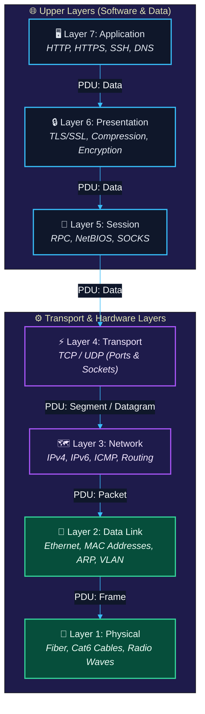
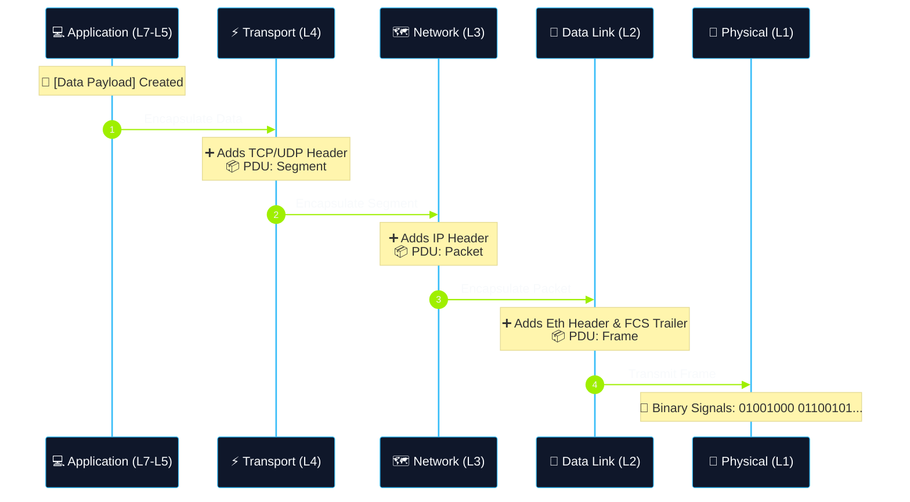

# 01 - OSI Model & Data Encapsulation

> [!NOTE]
> The **OSI (Open Systems Interconnection) Model** is a conceptual framework created by ISO that standardizes the functions of a telecommunication or computing system into 7 distinct layers.

---

## [+] The 7 Layers of the OSI Model

| Layer # | Layer Name | Protocol Data Unit (PDU) | Primary Function & Focus | Key Protocols / Standards | Cybersecurity Relevance |
| :---: | :--- | :--- | :--- | :--- | :--- |
| **7** | **Application** | Data | Human-computer interaction, network services to applications. | HTTP, HTTPS, FTP, SSH, DNS, SMTP | Web attacks, API abuse, C2 traffic |
| **6** | **Presentation** | Data | Data formatting, encryption, decryption, compression. | TLS/SSL, ASCII, JPEG, BASE64 | Encryption bypass, TLS manipulation |
| **5** | **Session** | Data | Interhost communication management, session establishment/teardown. | NetBIOS, RPC, SOCKS | Session hijacking, RPC enumeration |
| **4** | **Transport** | Segment (TCP) / Datagram (UDP) | End-to-end connections, flow control, error checking, port addressing. | TCP, UDP | Port scanning, SYN floods, socket binding |
| **3** | **Network** | Packet | Path determination, logical IP addressing, routing across networks. | IPv4, IPv6, ICMP, IPsec | IP spoofing, ICMP tunneling, routing attacks |
| **2** | **Data Link** | Frame | Physical addressing (MAC), error detection, node-to-node transfer. | Ethernet, Wi-Fi (802.11), ARP, VLAN | ARP spoofing, MAC flooding, VLAN hopping |
| **1** | **Physical** | Bits | Transmission of raw bit streams over physical medium. | Cables (Cat6, Fiber), Hubs, Network Interface Cards (NIC) | Hardware implants, physical tapping, jamming |

---

---

## [+] Protocol Data Units (PDUs) & Encapsulation

As data travels down the OSI stack from Layer 7 to Layer 1 during transmission, each layer adds its own header (and sometimes trailer). This process is called **Encapsulation**.

When receiving data, the process is reversed from Layer 1 up to Layer 7, stripping headers at each step. This is called **Decapsulation**.

---

## [+] Practical Security Implications

- **Layer 2 (Data Link)**: Attacks like ARP poisoning allow Man-in-the-Middle (MitM) positioning inside a local LAN segment.
- **Layer 3 (Network)**: Firewalls operate heavily here by checking source/destination IP addresses and routing rules.
- **Layer 4 (Transport)**: Port scanners like Nmap manipulate TCP flags (SYN, FIN, NULL, XMAS) to detect open/filtered ports.
- **Layer 7 (Application)**: Web Application Firewalls (WAF) inspect payload data (Layer 7) to block attacks like SQL Injection and XSS.

---

## [*] Navigation

- **Previous**: [README.md](file:///d:/Jorge/ciberseguridad/htb-journey/academy/network-fundamentals/README.md)
- **Next**: [02-tcp-ip-model-and-protocols.md](file:///d:/Jorge/ciberseguridad/htb-journey/academy/network-fundamentals/02-tcp-ip-model-and-protocols.md)
