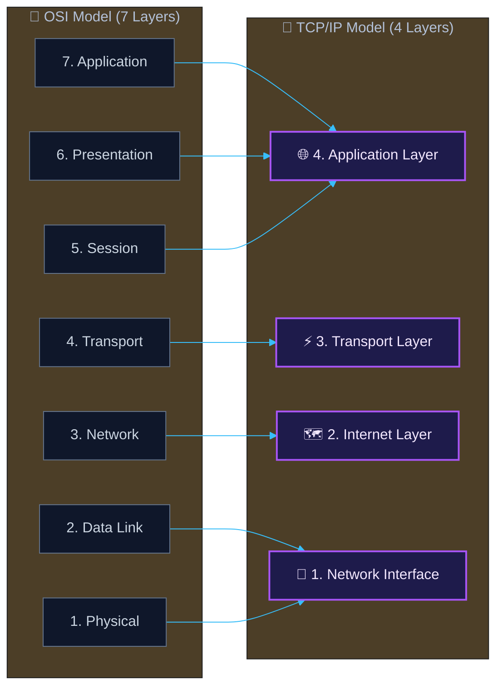
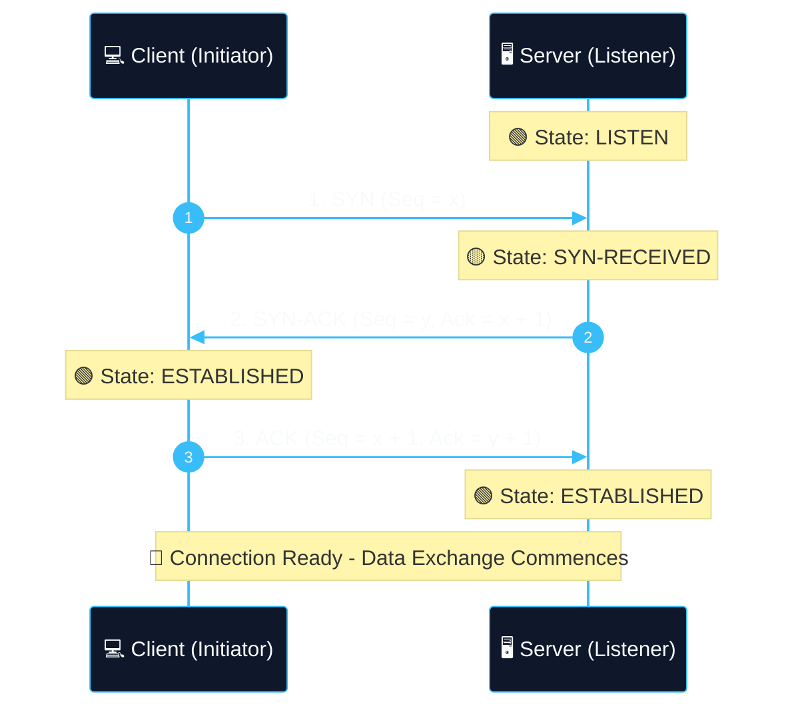
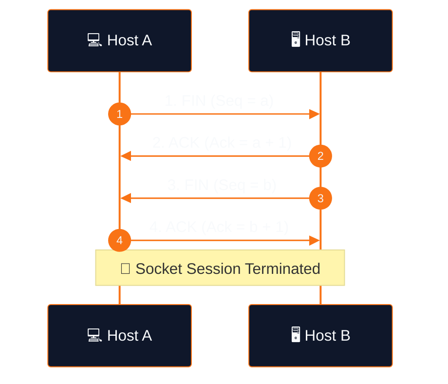

# 02 - TCP/IP Model & Core Protocols

> [!NOTE]
> While the OSI Model is theoretical, the **TCP/IP Model (Internet Protocol Suite)** is the practical operational model implemented in modern computer networks and the Internet.

---

## [+] OSI Model vs. TCP/IP Model Mapping

---

## [+] TCP vs. UDP Comparison

| Feature | TCP (Transmission Control Protocol) | UDP (User Datagram Protocol) |
| :--- | :--- | :--- |
| **Connection Type** | Connection-oriented (Handshake required) | Connectionless (Fire and forget) |
| **Reliability** | Guaranteed delivery (retransmissions, sequencing) | Best-effort (no delivery guarantee) |
| **Header Size** | 20-60 Bytes | 8 Bytes |
| **Speed** | Slower (overhead due to reliability controls) | Faster (minimal overhead) |
| **Use Cases** | HTTP/S, SSH, FTP, SMTP, SMB | DNS queries, Video Streaming, VoIP, DHCP |

---

## [+] TCP Connection Life Cycle

### 1. TCP 3-Way Handshake (Establishment)

### 2. TCP Graceful Connection Teardown (FIN / ACK)

### Connection Flags Overview:
- **SYN (Synchronize)**: Initiates connection sequence.
- **ACK (Acknowledge)**: Confirms receipt of packet.
- **FIN (Finish)**: Initiates graceful shutdown.
- **RST (Reset)**: Abruptly terminates connection due to error/unwanted port.
- **PSH (Push)**: Forces immediate delivery of buffered data.
- **URG (Urgent)**: Indicates data marked as urgent.

---

## [+] Essential Network Protocols & Ports

| Protocol | Default Port | Transport | Purpose / Description |
| :--- | :--- | :--- | :--- |
| **FTP** | 21 (Data 20) | TCP | File Transfer Protocol |
| **SSH** | 22 | TCP | Secure Shell (Encrypted remote terminal) |
| **Telnet** | 23 | TCP | Unencrypted remote terminal |
| **SMTP** | 25 | TCP | Simple Mail Transfer Protocol |
| **DNS** | 53 | UDP / TCP | Domain Name System (IP resolution) |
| **DHCP** | 67 (Server), 68 (Client) | UDP | Dynamic Host Configuration Protocol |
| **HTTP** | 80 | TCP | Hypertext Transfer Protocol |
| **Kerberos** | 88 | TCP/UDP | Authentication protocol (Active Directory) |
| **POP3** | 110 | TCP | Post Office Protocol |
| **RPC / Endpoint Mapper** | 135 | TCP | Remote Procedure Call |
| **NetBIOS** | 139 | TCP | Network Basic Input/Output System |
| **IMAP** | 143 | TCP | Internet Message Access Protocol |
| **SNMP** | 161 | UDP | Simple Network Management Protocol |
| **LDAP** | 389 | TCP | Lightweight Directory Access Protocol |
| **HTTPS** | 443 | TCP | HTTP Secure (TLS/SSL encrypted) |
| **SMB** | 445 | TCP | Server Message Block (File/Printer sharing) |
| **RDP** | 3389 | TCP | Remote Desktop Protocol |

---

## [*] Navigation

- **Previous**: [01-osi-model.md](file:///d:/Jorge/ciberseguridad/htb-journey/academy/network-fundamentals/01-osi-model.md)
- **Next**: [03-ip-addressing-and-subnetting.md](file:///d:/Jorge/ciberseguridad/htb-journey/academy/network-fundamentals/03-ip-addressing-and-subnetting.md)
