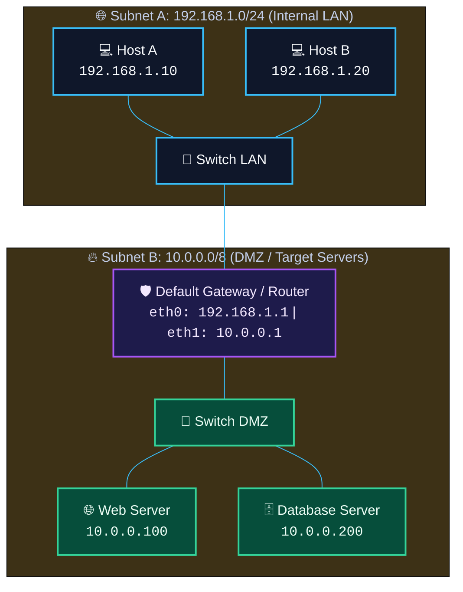

# 03 - IP Addressing & Subnetting


> [!NOTE]
> IP addresses identify devices on a network. Subnetting partitions networks into smaller logical subnetworks to improve security, reduce broadcast domain sizes, and optimize performance.

---

## [+] IPv4 Address Structure & Classes

An IPv4 address consists of **32 bits**, divided into 4 octets (8 bits each) separated by dots:
`192.168.1.1` ──► `11000000.10101000.00000001.00000001`

### Private IPv4 Ranges (RFC 1918):
- **Class A**: `10.0.0.0` – `10.255.255.255` (`10.0.0.0/8`)
- **Class B**: `172.16.0.0` – `172.31.255.255` (`172.16.0.0/12`)
- **Class C**: `192.168.0.0` – `192.168.255.255` (`192.168.0.0/16`)



---

## [+] Subnet Masks & CIDR Notation

Subnet masks define which part of an IP address belongs to the **Network ID** vs the **Host ID**.

| CIDR Prefix | Subnet Mask | Total Hosts | Usable Hosts |
| :--- | :--- | :--- | :--- |
| `/24` | `255.255.255.0` | 256 | 254 |
| `/25` | `255.255.255.128` | 128 | 126 |
| `/26` | `255.255.255.192` | 64 | 62 |
| `/27` | `255.255.255.224` | 32 | 30 |
| `/28` | `255.255.255.240` | 16 | 14 |
| `/29` | `255.255.255.248` | 8 | 6 |
| `/30` | `255.255.255.252` | 4 | 2 (Point-to-Point) |
| `/32` | `255.255.255.255` | 1 | 1 (Single Host) |

> **Usable Hosts Formula**: $2^{(32 - \text{CIDR})} - 2$  
> *(Minus 2 accounts for the Network Address and Broadcast Address).*

---

## [+] Essential Network Analysis Tools

### 1. Wireshark & TShark
Wireshark is the standard graphical network packet analyzer. TShark is its command-line version.

```bash
# Capture packets on interface eth0
tshark -i eth0 -c 100

# Apply display filter for HTTP POST requests
tshark -r capture.pcap -Y "http.request.method == POST"
```

### 2. Tcpdump
Command-line packet analyzer for Linux.

```bash
# Capture and display hex/ASCII payload output
tcpdump -nn -X -i eth0 port 80 or port 443
```

---

## [*] Navigation

- **Previous**: [02-tcp-ip-model-and-protocols.md](file:///d:/Jorge/ciberseguridad/htb-journey/academy/network-fundamentals/02-tcp-ip-model-and-protocols.md)
- **Module Index**: [README.md](file:///d:/Jorge/ciberseguridad/htb-journey/academy/network-fundamentals/README.md)
