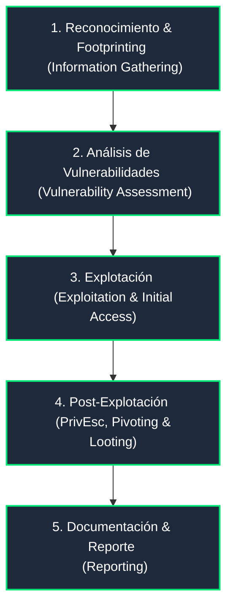

# 🛡️ HTB Academy: Penetration Tester Path

Bienvenido a la sección dedicada al camino de especialización **Certified Penetration Testing Specialist (CPTS)** de Hack The Box Academy. Aquí se recopilarán apuntes, metodologías, comandos específicos y ejercicios prácticos de cada uno de los módulos que componen esta ruta de aprendizaje.

---

## 🧭 Metodología de Trabajo (Fases de un Pentest)

Toda auditoría de seguridad sigue un ciclo metodológico estructurado que aplicamos a lo largo de este curso:

---

## 📚 Módulos del Curso y Progreso

A continuación se detalla la estructura oficial de módulos del path de Penetration Tester de HTB Academy para el seguimiento del aprendizaje:

### 🔍 Fase 1: Información y Reconocimiento
- [ ] **Introducción al Proceso de Pentesting** *(Penetration Testing Process)*
- [ ] **Footprinting de Redes e Infraestructura** *(Footprinting)*
- [ ] **Recolección de Información - Web** *(Information Gathering - Web)*
- [ ] **Conceptos Básicos de Nmap** *(Nmap Basics)*

### ⚙️ Fase 2: Análisis y Accesos Iniciales
- [ ] **Evaluación de Vulnerabilidades** *(Vulnerability Assessment)*
- [ ] **Transferencia de Archivos** *(File Transfers)*
- [ ] **Shells y Payloads**
- [ ] **Uso del Metasploit Framework**

### 💻 Fase 3: Explotación y Ataques Específicos
- [ ] **Ataques a Aplicaciones Web** *(Web Attacks)*
- [ ] **Ataques a Servicios Web** *(Web Service Attacks)*
- [ ] **Ataques de Contraseña** *(Password Attacks)*
- [ ] **Inyección SQL (SQLi)**

### 👑 Fase 4: Post-Explotación y Pivoting
- [ ] **Escalada de Privilegios en Windows** *(Windows Privilege Escalation)*
- [ ] **Escalada de Privilegios en Linux** *(Linux Privilege Escalation)*
- [ ] **Pivoting, Tunneling y Port Forwarding**
- [ ] **Ataques a Directorio Activo** *(Active Directory Attacks)*

### 📝 Fase 5: Reporte y Entrega
- [ ] **Documentación y Creación de Reportes** *(Documentation & Reporting)*

---

## 🛠️ Entorno de Laboratorio Sugerido

Para realizar las prácticas de esta ruta, se utiliza un entorno de laboratorio basado en:
*   **Parrot OS / Kali Linux**: Distribuciones oficiales de pruebas de penetración.
*   **Pwnbox**: La instancia de escritorio remoto provista por HTB.
*   **Conexión VPN**: Archivo de configuración `.ovpn` para conectarse a la red de laboratorios de HTB.

> [!IMPORTANT]
> Recuerda actualizar tu progreso marcando las casillas `[ ]` con `[x]` a medida que completes los apuntes y ejercicios de cada módulo en este repositorio.
