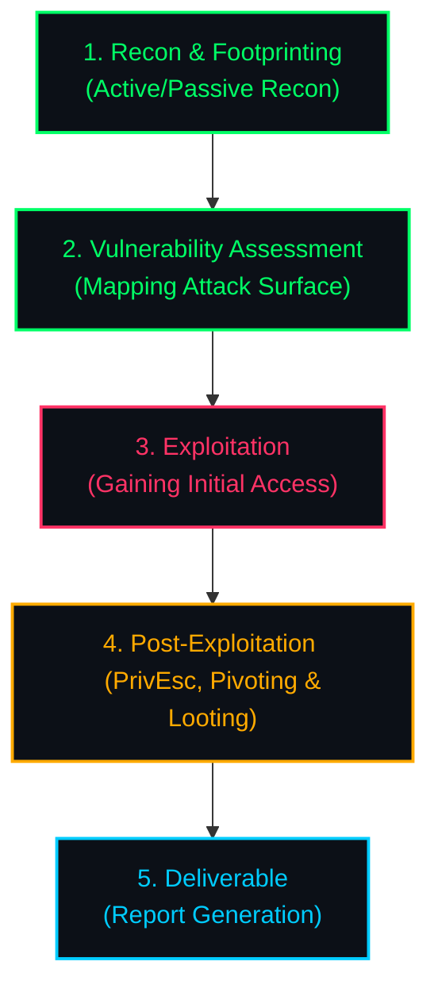

# HTB Academy: Certified Penetration Testing Specialist (CPTS) Path

> [!NOTE]
> **OFFENSIVE AUDIT JOURNAL**  
> "An auditor's goal is not just to break, but to map, explain, and guide."

---

## [>] ENGAGEMENT METHODOLOGY

Our simulated pentest follows a structured lifecycle to map and exploit targets systematically:

---

## [+] OPERATION MANIFEST (Syllabus & Progress)

Tracks active learning tasks across all core penetration testing modules:

### [>] Introduction
- [ ] `01` [Penetration Testing Process](./01-penetration-testing-process/README.md)
- [ ] `02` [Getting Started](./02-getting-started/README.md)

### [>] Reconnaissance, Enumeration & Attack Planning
- [ ] `03` [Network Enumeration with Nmap](./03-network-enumeration-nmap/README.md)
- [ ] `04` [Footprinting](./04-footprinting/README.md)
- [ ] `05` [Information Gathering - Web Edition](./05-information-gathering-web/README.md)
- [ ] `06` [Vulnerability Assessment](./06-vulnerability-assessment/README.md)
- [ ] `07` [File Transfers](./07-file-transfers/README.md)
- [ ] `08` [Shells & Payloads](./08-shells-payloads/README.md)
- [ ] `09` [Using the Metasploit Framework](./09-metasploit-framework/README.md)

### [>] Exploitation & Lateral Movement
- [ ] `10` [Password Attacks](./10-password-attacks/README.md)
- [ ] `11` [Attacking Common Services](./11-attacking-common-services/README.md)
- [ ] `12` [Pivoting, Tunneling, and Port Forwarding](./12-pivoting-tunneling-port-forwarding/README.md)
- [ ] `13` [Active Directory Enumeration & Attacks](./13-active-directory-enumeration-attacks/README.md)

### [>] Web Exploitation
- [ ] `14` [Using Web Proxies](./14-web-proxies/README.md)
- [ ] `15` [Attacking Web Applications with Ffuf](./15-attacking-web-applications-ffuf/README.md)
- [ ] `16` [Login Brute Forcing](./16-login-brute-forcing/README.md)
- [ ] `17` [SQL Injection Fundamentals](./17-sql-injection-fundamentals/README.md)
- [ ] `18` [SQLMap Essentials](./18-sqlmap-essentials/README.md)
- [ ] `19` [Cross-Site Scripting (XSS)](./19-xss/README.md)
- [ ] `20` [File Inclusion](./20-file-inclusion/README.md)
- [ ] `21` [File Upload Attacks](./21-file-upload-attacks/README.md)
- [ ] `22` [Command Injections](./22-command-injections/README.md)
- [ ] `23` [Web Attacks](./23-web-attacks/README.md)
- [ ] `24` [Attacking Common Applications](./24-attacking-common-applications/README.md)

### [>] Post-Exploitation
- [ ] `25` [Linux Privilege Escalation](./25-linux-privilege-escalation/README.md)
- [ ] `26` [Windows Privilege Escalation](./26-windows-privilege-escalation/README.md)

### [>] Reporting & Capstone
- [ ] `27` [Documentation & Reporting](./27-documentation-reporting/README.md)
- [ ] `28` [Attacking Enterprise Networks](./28-attacking-enterprise-networks/README.md)

---

## [!] TACTICAL ENVIRONMENT

- **Operational OS**: Parrot Security OS / Kali Linux (customized toolkit)
- **Lab Gateway**: `Pwnbox` / Dedicated VPN (`.ovpn` tunnel)
- **Documentation Standard**: Clean, markdown-based reporting format

> [!WARNING]
> All tactics, payloads, and methodologies documented in this repository are for authorized security audits and educational exercises only. Keep all client target data sanitized.
